# Infraestructura 3 — VPN de Acceso Remoto con FortiGate (IPsec + FortiClient)

**Jose Gabriel Feliz Maria · Matrícula: 2025-0742**
**Seguridad de Redes · ITLA**

---

## 🎥 Video Demostrativo

**[Ver demostración en YouTube](PEGAR_AQUI_EL_LINK_DEL_VIDEO)** ⚠️ *(pendiente de grabar/subir)*

En el video se muestra la hora y fecha del sistema, el rostro y la voz del autor, y la demostración de que **el Usuario entra a la página web del Servidor por HTTPS sin VPN, pero solo puede entrar por SSH al Servidor cuando está conectado a la VPN de acceso remoto (FortiClient)**.

---

## 📋 Tabla de Contenido

1. [Propósito del Laboratorio](#1-propósito-del-laboratorio)
2. [Topología](#2-topología)
3. [Direccionamiento IP](#3-direccionamiento-ip)
4. [ISP (Cisco IOL)](#4-isp-cisco-iol)
5. [Router R-USUARIOS: DHCP y NAT de la VLAN 10](#5-router-r-usuarios-dhcp-y-nat-de-la-vlan-10)
6. [Switch SW-A (VLAN 10)](#6-switch-sw-a-vlan-10)
7. [FortiGate FGT-SERVIDOR: Red, VIP y Políticas (GUI)](#7-fortigate-fgt-servidor-red-vip-y-políticas-gui)
8. [VPN de Acceso Remoto (IPsec Dialup + FortiClient)](#8-vpn-de-acceso-remoto-ipsec-dialup--forticlient)
9. [Servidor Web HTTPS y SSH (Kali)](#9-servidor-web-https-y-ssh-kali)
10. [Pruebas y Verificación](#10-pruebas-y-verificación)
11. [Problemas Encontrados y Soluciones](#11-problemas-encontrados-y-soluciones)
12. [Scripts y Running-Configs](#12-scripts-y-running-configs)
13. [Evidencias (Capturas)](#13-evidencias-capturas)
14. [Notas y Limitaciones del Laboratorio](#14-notas-y-limitaciones-del-laboratorio)

---

## 1. Propósito del Laboratorio

Publicar un servidor web en Internet detrás de un **FortiGate** y dar acceso administrativo a ese servidor **solo a través de una VPN de acceso remoto**. El Usuario está en otro sitio (VLAN 10, detrás de un router Cisco y del ISP) y usa **FortiClient** para conectarse. Los objetivos de seguridad son:

1. **HTTPS público sin VPN.** El Usuario llega a la página web del Servidor escribiendo `https://200.7.42.6`. El FortiGate publica solo el puerto **TCP 443** del servidor mediante un **Virtual IP (VIP)** y una política que permite únicamente el servicio HTTPS.
2. **SSH solo con VPN.** El puerto 22 del servidor no está publicado. Para administrarlo por SSH, el Usuario debe conectarse con FortiClient a la **VPN IPsec de acceso remoto (dialup)** del FortiGate, autenticarse con usuario y contraseña (**XAuth**, grupo `GRUPO_VPN`) y recibir una IP del pool de la VPN. Solo esas IPs pueden llegar al servidor por **SSH y PING**.

Requisitos de red cubiertos: servidor en una subred **/28** con HTTPS y SSH; usuarios en una subred **/25** en la **VLAN 10**, con **DHCP** y pruebas de **traceroute**; un FortiGate y un equipo de red Cisco. Toda la configuración y demostración del FortiGate se hizo por **interfaz gráfica (GUI)**; los equipos Cisco se configuraron por CLI.

---

## 2. Topología

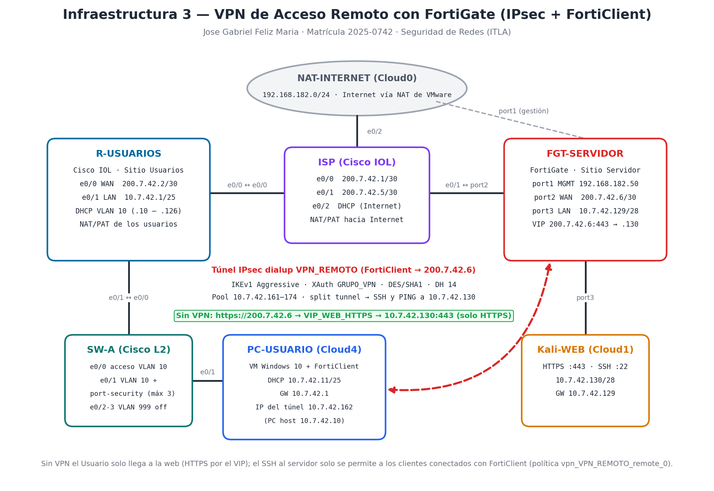

Topología montada en PNETLab (laboratorio independiente de las Infraestructuras 1 y 2):

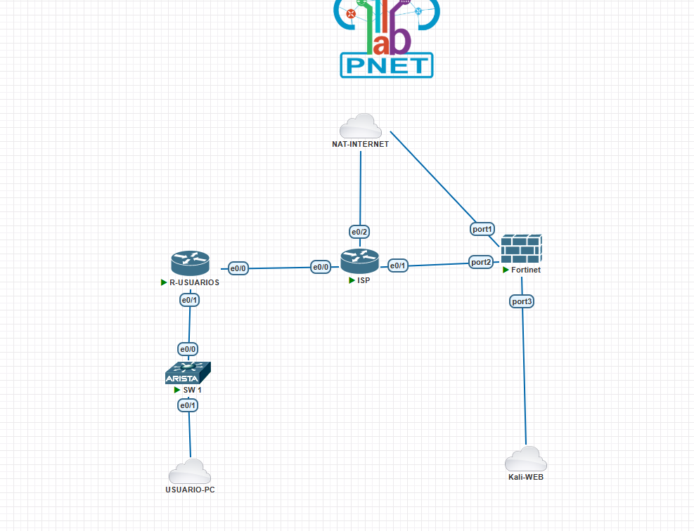

| Equipo | Rol |
|---|---|
| **FGT-SERVIDOR** | FortiGate del sitio Servidor: gateway del servidor, VIP para HTTPS, servidor de la VPN de acceso remoto y NAT hacia Internet |
| **R-USUARIOS** | Router Cisco IOL del sitio Usuarios: gateway y servidor DHCP de la VLAN 10 y NAT (PAT) hacia el ISP |
| **ISP** | Router Cisco IOL que entrega las IPs públicas y da salida a Internet con NAT |
| **SW-A** | Switch Cisco IOL L2 con la VLAN 10 de Usuarios y port-security |
| **PC-USUARIO** | Nube Cloud4 (VMnet8): la **VM Windows 10 con FortiClient** (y el PC host) conectados a la VLAN 10 |
| **Kali-WEB** | Servidor web HTTPS (Apache) y SSH |
| **NAT-INTERNET** | Nube Cloud0 de PNETLab: Internet del ISP y red de gestión del FortiGate |

---

## 3. Direccionamiento IP

Direccionamiento privado basado en la matrícula **2025-0742** (`10.7.42.0/24`) e IPs públicas del ISP en `200.7.42.0/29`.

| Red | Subred | Gateway | Uso |
|---|---|---|---|
| Usuarios (VLAN 10) | `10.7.42.0/25` | `10.7.42.1` (R-USUARIOS) | DHCP `10.7.42.10 – 10.7.42.126` |
| Servidor Web | `10.7.42.128/28` | `10.7.42.129` (FGT-SERVIDOR) | Kali-WEB `10.7.42.130` |
| Clientes VPN (pool) | `10.7.42.160/28` | — | FortiClient recibe `10.7.42.161 – 10.7.42.174` |
| WAN R-USUARIOS ↔ ISP | `200.7.42.0/30` | `200.7.42.1` (ISP) | IP pública R-USUARIOS `200.7.42.2` |
| WAN FGT-SERVIDOR ↔ ISP | `200.7.42.4/30` | `200.7.42.5` (ISP) | IP pública FortiGate `200.7.42.6` (VIP y VPN) |
| Gestión / Internet | `192.168.182.0/24` | `192.168.182.2` | port1 del FortiGate y e0/2 del ISP |

| Equipo | Interfaz | IP |
|---|---|---|
| FGT-SERVIDOR | port1 (MGMT) | `192.168.182.50/24` |
| FGT-SERVIDOR | port2 (WAN_ISP) | `200.7.42.6/30` |
| FGT-SERVIDOR | port3 (LAN_SERVIDOR) | `10.7.42.129/28` |
| R-USUARIOS | Ethernet0/0 (WAN) | `200.7.42.2/30` |
| R-USUARIOS | Ethernet0/1 (LAN VLAN 10) | `10.7.42.1/25` |
| ISP | e0/0 · e0/1 · e0/2 | `200.7.42.1/30` · `200.7.42.5/30` · DHCP |
| VM Windows 10 (PC-USUARIO) | Ethernet | DHCP `10.7.42.11/25` · túnel VPN `10.7.42.162` |
| PC host (Windows 11) | VMnet8 | DHCP `10.7.42.10/25` |
| Kali-WEB | eth1 | `10.7.42.130/28` |

---

## 4. ISP (Cisco IOL)

- Entrega las IPs públicas `200.7.42.1/30` (hacia R-USUARIOS) y `200.7.42.5/30` (hacia el FortiGate).
- Sale a Internet por `e0/2` (DHCP) con **NAT/PAT** para las redes públicas `200.7.42.0/29`.
- **No tiene rutas hacia las redes privadas `10.7.42.x`**, igual que un proveedor real: desde el sitio Usuarios solo se puede llegar al FortiGate por su IP pública `200.7.42.6`.
- Seguridad básica: `enable secret`, `service password-encryption`, banner, contraseña de consola y acceso remoto solo por **SSH v2** con usuario local.

Script: [`scripts/ISP_config.txt`](scripts/ISP_config.txt)

---

## 5. Router R-USUARIOS: DHCP y NAT de la VLAN 10

```
interface Ethernet0/0
 description WAN-ISP (IP publica sitio Usuarios)
 ip address 200.7.42.2 255.255.255.252
 ip nat outside
interface Ethernet0/1
 description LAN-USUARIOS (VLAN 10 via SW-A)
 ip address 10.7.42.1 255.255.255.128
 ip nat inside
ip route 0.0.0.0 0.0.0.0 200.7.42.1
!
ip dhcp excluded-address 10.7.42.1 10.7.42.9
ip dhcp pool USUARIOS-VLAN10
 network 10.7.42.0 255.255.255.128
 default-router 10.7.42.1
 dns-server 8.8.8.8 8.8.4.4
!
access-list 10 permit 10.7.42.0 0.0.0.127
ip nat inside source list 10 interface Ethernet0/0 overload
```

- Es el gateway (`10.7.42.1`) y el **servidor DHCP** de la VLAN 10: reparte `10.7.42.10 – 10.7.42.126` (se excluyen `.1 – .9`).
- Traduce (PAT) a los usuarios a su IP pública `200.7.42.2`. Por eso el FortiGate ve a los clientes VPN llegar desde `200.7.42.2` y la VPN usa **NAT-Traversal** (UDP 4500).

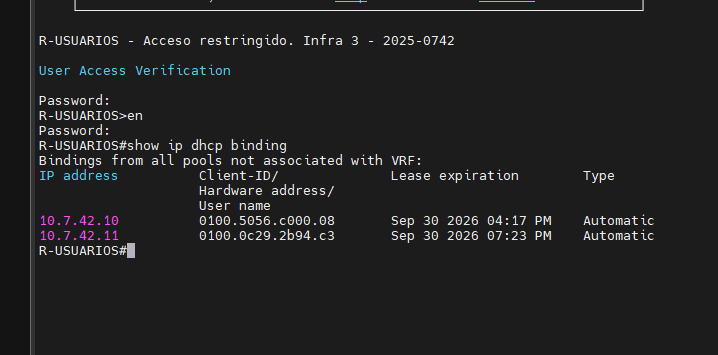

Script: [`scripts/R-USUARIOS_config.txt`](scripts/R-USUARIOS_config.txt)

---

## 6. Switch SW-A (VLAN 10)

- **VLAN 10 (USUARIOS)** en `e0/0` (hacia R-USUARIOS `e0/1`) y `e0/1` (PC-USUARIO), en modo acceso con `portfast`.
- `e0/1` con **port-security** (máximo **3** MAC, *sticky*, violación *restrict*) y **BPDU Guard**. Son 3 porque por la nube Cloud4 llegan la VM Windows 10, el adaptador VMnet8 del PC host y la interfaz de la propia VM de PNETLab (ver [problema 11.3](#113-port-security-bloqueaba-a-la-vm-windows-10)).
- Puertos sin uso (`e0/2 – e0/3`) en la **VLAN 999** y apagados.
- Seguridad básica: `enable secret`, `service password-encryption`, banner y contraseña en consola y VTY.

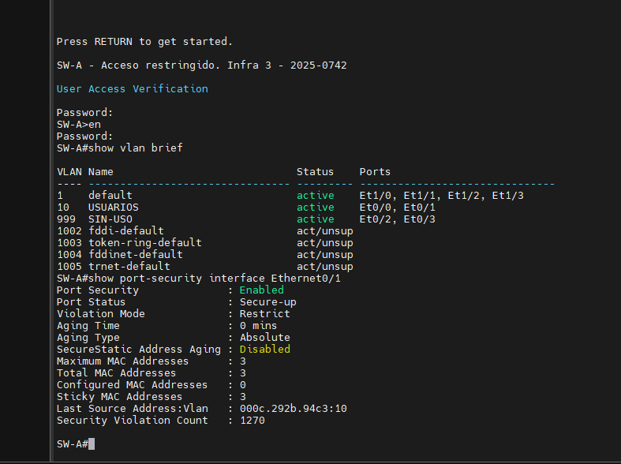

Script: [`scripts/SW-A_config.txt`](scripts/SW-A_config.txt)

---

## 7. FortiGate FGT-SERVIDOR: Red, VIP y Políticas (GUI)

El FortiGate se instaló nuevo para este laboratorio. Solo el acceso inicial se hizo por consola (IP de gestión en `port1` y acceso HTTP, ver [`scripts/FGT-SERVIDOR_acceso_inicial_CLI.txt`](scripts/FGT-SERVIDOR_acceso_inicial_CLI.txt)); todo lo demás se configuró por GUI.

| Paso (GUI) | Configuración |
|---|---|
| System → Settings | Hostname `FGT-SERVIDOR`, zona horaria GMT-4, NTP FortiGuard |
| Network → DNS | `8.8.8.8` / `8.8.4.4` |
| Network → Interfaces → port1 | `MGMT` · `192.168.182.50/24` · HTTP/HTTPS/PING/SSH |
| Network → Interfaces → port2 | `WAN_ISP` · Role WAN · `200.7.42.6/255.255.255.252` · **solo PING** |
| Network → Interfaces → port3 | `LAN_SERVIDOR` · Role LAN · `10.7.42.129/255.255.255.240` · PING |
| Network → Static Routes | `0.0.0.0/0` → `200.7.42.5` (port2) |
| Policy & Objects → Addresses | `SERVIDOR_WEB` = `10.7.42.130/32` |
| Policy & Objects → Virtual IPs | `VIP_WEB_HTTPS`: `200.7.42.6` (port2) → `10.7.42.130`, **port forwarding TCP 443 → 443** |

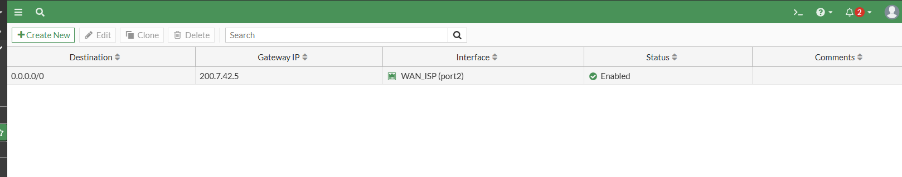

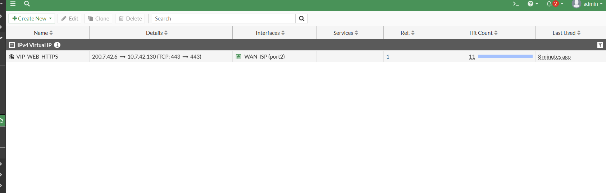

**Políticas de firewall:**

| Política | Origen → Destino | Direcciones | Servicio | NAT | Log |
|---|---|---|---|---|---|
| `WEB_HTTPS_PUBLICO` | port2 (WAN) → port3 | `all` → `VIP_WEB_HTTPS` | **HTTPS** | Deshabilitado | Todas las sesiones |
| `SERVIDOR_INTERNET` | port3 → port2 (WAN) | `all` → `all` | ALL | **Habilitado** | Todas las sesiones |
| `vpn_VPN_REMOTO_remote_0` | túnel `VPN_REMOTO` → port3 | `VPN_REMOTO_range` → `SERVIDOR_WEB` | **SSH, PING** | Deshabilitado | Todas las sesiones |

- `WEB_HTTPS_PUBLICO` es la única puerta abierta desde Internet: solo TCP 443 hacia el VIP. El puerto 22 del servidor no tiene VIP, y el `port2` solo acepta PING para administración, así que un SSH a `200.7.42.6` no tiene respuesta.
- `vpn_VPN_REMOTO_remote_0` la creó el asistente de la VPN; se cambió el servicio `ALL` por **SSH** y **PING** para que la VPN solo dé acceso administrativo al servidor. Sin NAT, el servidor ve la IP real del cliente VPN (`10.7.42.16x`).

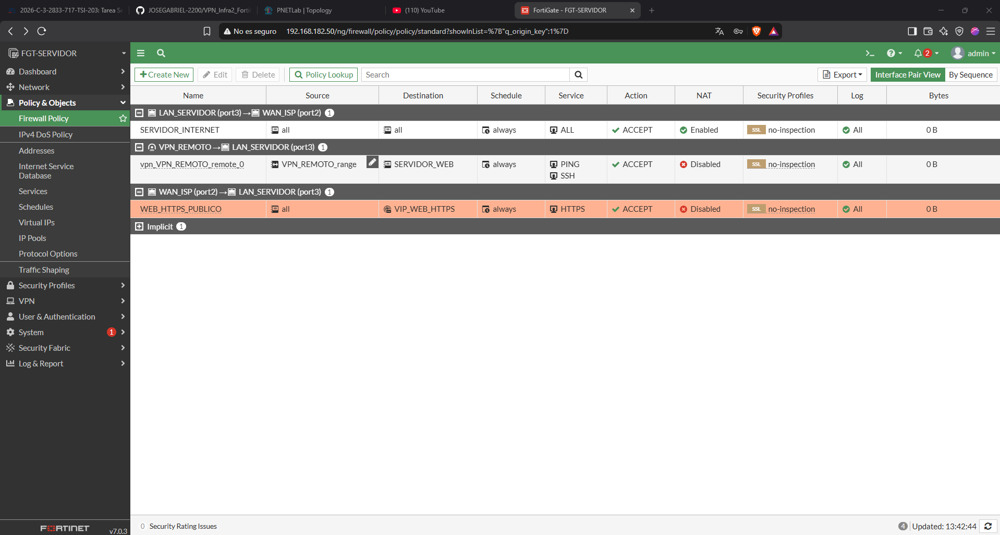

---

## 8. VPN de Acceso Remoto (IPsec Dialup + FortiClient)

### 8.1 Usuario y grupo (User & Authentication)

- **User Definition:** usuario local `jgabriel` (contraseña no publicada).
- **User Groups:** `GRUPO_VPN` (tipo Firewall) con el miembro `jgabriel`. La VPN solo acepta usuarios de este grupo (XAuth).

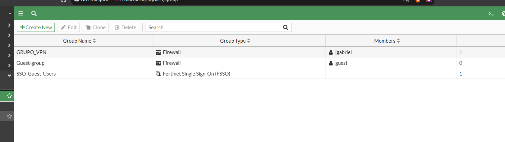

### 8.2 FortiGate (GUI)

**VPN → IPsec Wizard → Remote Access · Client-based · FortiClient**

| Parámetro | Valor |
|---|---|
| Nombre | `VPN_REMOTO` |
| Incoming interface | port2 (`200.7.42.6`) |
| Autenticación | Pre-shared Key *(no publicada)* + **XAuth** con el grupo `GRUPO_VPN` |
| Local interface / address | port3 · `SERVIDOR_WEB` (`10.7.42.130/32`) |
| Client address range | `10.7.42.161 – 10.7.42.174` · máscara `255.255.255.240` |
| DNS | DNS del sistema |
| IPv4 Split Tunnel | **Activado** (solo el tráfico hacia `SERVIDOR_WEB` va por el túnel) |
| Client options | Save password activado · Auto Connect y Always Up desactivados |

El asistente creó una Fase 1 de tipo **dynamic (dialup)** en **modo Aggressive** con **Mode Config** (el FortiGate le asigna la IP al cliente), el objeto `VPN_REMOTO_range`, el grupo de split tunnel `VPN_REMOTO_split` y la política `vpn_VPN_REMOTO_remote_0`. Configuración resultante (la PSK aparece redactada):

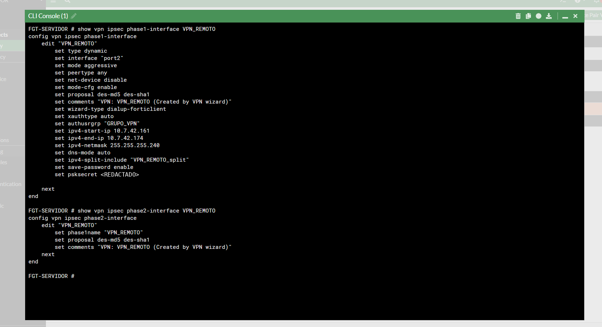

```
config vpn ipsec phase1-interface
    edit "VPN_REMOTO"
        set type dynamic
        set interface "port2"
        set mode aggressive
        set peertype any
        set net-device disable
        set mode-cfg enable
        set proposal des-md5 des-sha1
        set wizard-type dialup-forticlient
        set xauthtype auto
        set authusrgrp "GRUPO_VPN"
        set ipv4-start-ip 10.7.42.161
        set ipv4-end-ip 10.7.42.174
        set ipv4-netmask 255.255.255.240
        set dns-mode auto
        set ipv4-split-include "VPN_REMOTO_split"
        set save-password enable
        set psksecret ENC <REDACTADO>
    next
end
config vpn ipsec phase2-interface
    edit "VPN_REMOTO"
        set phase1name "VPN_REMOTO"
        set proposal des-md5 des-sha1
    next
end
```

### 8.3 FortiClient (VM Windows 10)

**FortiClient VPN 7.4.3 → Remote Access → Add a new connection → IPsec VPN**

| Campo | Valor |
|---|---|
| Connection Name | `VPN_REMOTO_0742` |
| Remote Gateway | `200.7.42.6` |
| Authentication Method | Pre-shared key *(no publicada)* |
| Authentication (XAuth) | Prompt on login → usuario `jgabriel` |
| IKE | **Version 1** · Mode **Aggressive** · Options **Mode Config** |
| DH Group | **solo 14** (ver [problema 11.1](#111-forticlient-se-quedaba-conectando-failed-to-compute-dh-shared-secret)) |
| Phase 1 | DES/SHA1 y DES/MD5 · NAT Traversal y Dead Peer Detection activados |
| Phase 2 | DES/SHA1 y DES/MD5 · **PFS** activado con DH 14 |

### 8.4 Parámetros negociados

| Parámetro | FortiGate | FortiClient |
|---|---|---|
| IKE | v1, **Aggressive**, dialup (acepta cualquier IP) | v1, **Aggressive** |
| Fase 1 | `des-md5`, `des-sha1` · DH 14 | DES/SHA1, DES/MD5 · DH 14 |
| Autenticación | PSK + XAuth (`GRUPO_VPN`) | PSK + usuario/contraseña |
| NAT-T | Detectado: el cliente llega desde `200.7.42.2` (PAT del R-USUARIOS) | UDP 4500 |
| IP del cliente | Mode Config, pool `10.7.42.161 – .174` | Recibe `10.7.42.162` |
| Fase 2 | `des-md5`, `des-sha1` · PFS | DES/SHA1, DES/MD5 · PFS DH 14 |
| Split tunnel | `VPN_REMOTO_split` = `10.7.42.130/32` | Ruta solo hacia `10.7.42.130` por el túnel |

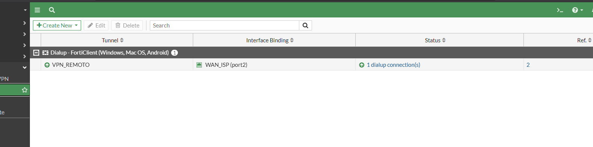

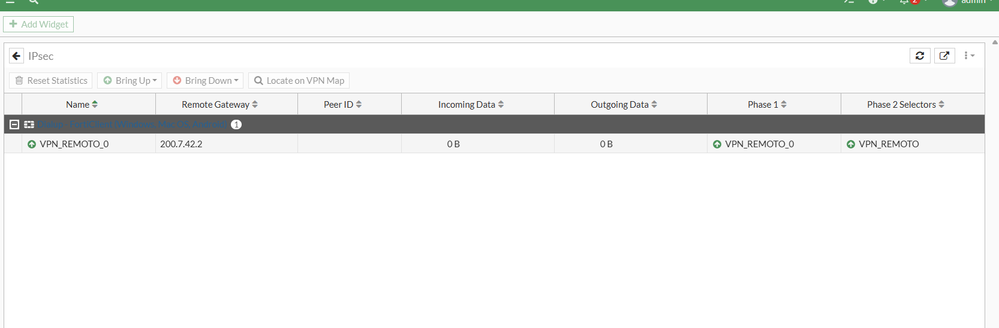

---

## 9. Servidor Web HTTPS y SSH (Kali)

- **Apache con SSL** en el puerto 443 (la misma página del laboratorio usada en prácticas anteriores) y **OpenSSH** en el puerto 22 (`sudo systemctl enable --now ssh`).
- IP `10.7.42.130/28` con gateway `10.7.42.129` (FGT-SERVIDOR).
- Desde Internet solo se publica el 443 (VIP). El 22 solo es alcanzable desde el pool de la VPN.

---

## 10. Pruebas y Verificación

| # | Prueba | Resultado |
|---|---|---|
| 1 | DHCP en la VLAN 10 (`show ip dhcp binding` en R-USUARIOS) | ✅ PC host `10.7.42.10` y VM Windows 10 `10.7.42.11` |
| 2 | `tracert 200.7.42.6` **sin VPN** | ✅ `10.7.42.1` → `200.7.42.1` → `200.7.42.6` |
| 3 | `https://200.7.42.6` **sin VPN** | ✅ Abre la página del servidor por el VIP `VIP_WEB_HTTPS` |
| 4 | `ssh jose@200.7.42.6` y `ssh jose@10.7.42.130` **sin VPN** | ✅ Ambos fallan: *Connection timed out* |
| 5 | FortiClient → Connect (VM Windows 10) | ✅ *VPN Connected*, IP `10.7.42.162`, usuario `jgabriel` |
| 6 | Estado en el FortiGate (VPN → IPsec Tunnels / widget IPsec) | ✅ `VPN_REMOTO`: **1 dialup connection**; `VPN_REMOTO_0` con Fase 1 y Fase 2 arriba desde `200.7.42.2` |
| 7 | `ping 10.7.42.130` **con VPN** | ✅ Responde (`TTL=63`) |
| 8 | `ssh jose@10.7.42.130` **con VPN** | ✅ Entra al Kali; `echo $SSH_CLIENT` → `10.7.42.162` (la IP de la VPN, sin NAT) |
| 9 | Logs Forward Traffic | ✅ SSH `10.7.42.162 → 10.7.42.130:22` por `vpn_VPN_REMOTO_remote_0`, desde la interfaz `VPN_REMOTO`; HTTPS `200.7.42.2 → 200.7.42.6` por `WEB_HTTPS_PUBLICO` |
| 10 | Desconectar FortiClient → `ssh` otra vez | 🎥 Demostrado en vivo en el video: el SSH vuelve a fallar y el HTTPS sigue funcionando |

**Sin VPN — HTTPS funciona por el VIP:**

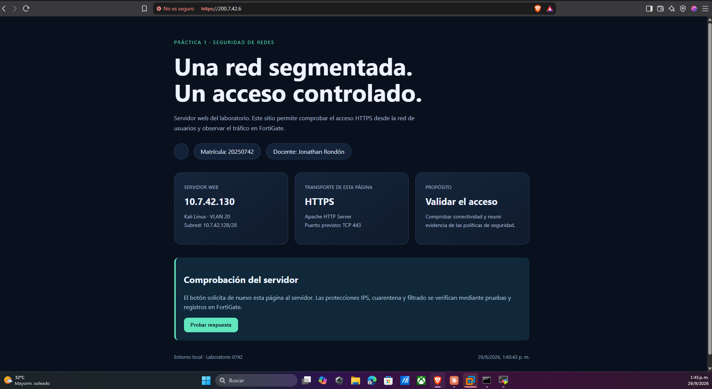

**Sin VPN — traceroute llega a la IP pública, pero el SSH no:** el SSH a `200.7.42.6` falla porque el VIP solo publica el 443 y el `port2` no permite administración por SSH; el SSH a `10.7.42.130` falla porque esa red privada no existe para el ISP (solo se alcanza por la VPN).

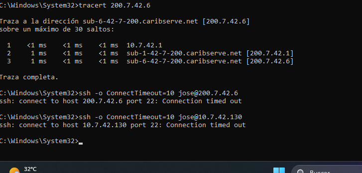

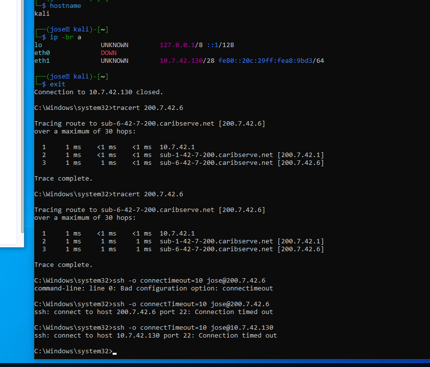

**Con VPN — FortiClient conectado y SSH al servidor:**

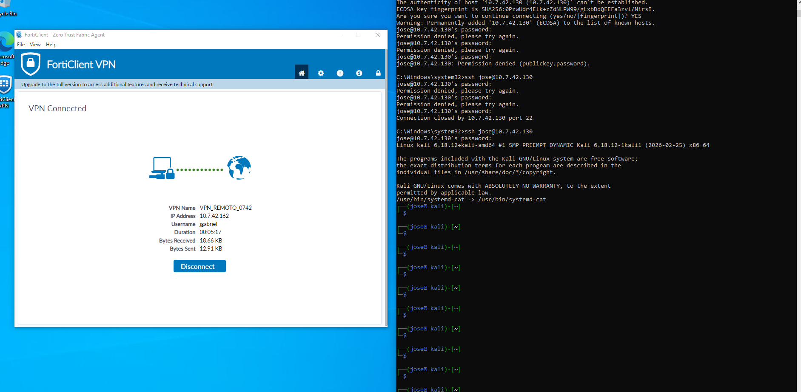

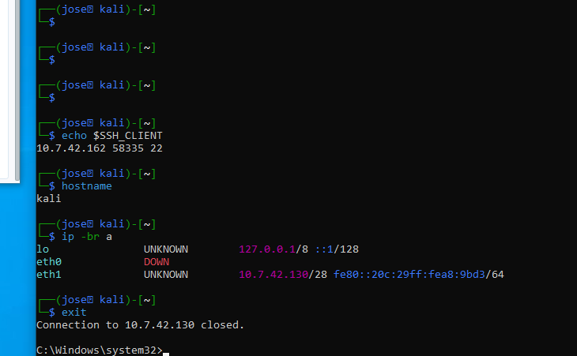

**Logs del FortiGate:** el SSH entra por la política de la VPN (`vpn_VPN_REMOTO_remote_0`, interfaz de origen `VPN_REMOTO`, servicio SSH) y el HTTPS por la política pública (`WEB_HTTPS_PUBLICO`).

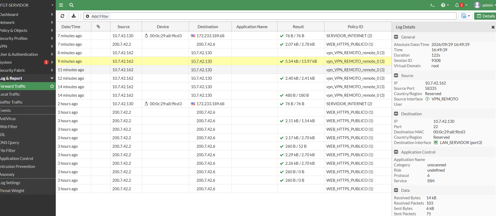

---

## 11. Problemas Encontrados y Soluciones

### 11.1 FortiClient se quedaba "conectando" (failed to compute DH shared secret)

Con `diagnose debug application ike -1` en el FortiGate se vio que la Fase 1 elegía `DES / MD5 / MODP2048 (DH 14)` y luego fallaba con **`failed to compute DH shared secret`**. En **modo Aggressive** el cliente envía su clave Diffie-Hellman en el **primer mensaje**, calculada para **un solo grupo**. FortiClient tenía marcados los grupos **5 y 14** y mandó la clave del grupo 5, pero el FortiGate eligió el 14, así que no podía calcular el secreto compartido. **Solución:** dejar **un solo grupo DH (14)** en FortiClient.

### 11.2 FortiClient en el PC host (Windows 11) conectaba, pero no pasaba tráfico

Con el DH corregido, FortiClient 7.4.3 en el PC host (Windows 11) mostraba *VPN Connected* (IP `10.7.42.161`) y el FortiGate tenía la Fase 1 y la Fase 2 arriba, pero **0 KB recibidos** y ningún ping llegaba al servidor.

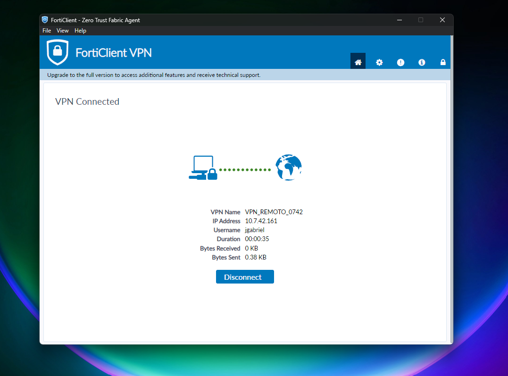

Diagnóstico:
- **Windows:** la ruta `10.7.42.130/32` apuntaba al adaptador de FortiClient y la ARP del gateway virtual era la de Fortinet, así que el tráfico sí entraba al adaptador virtual.
- **FortiGate:** `diagnose vpn tunnel list` con 0 paquetes cifrados/descifrados, y `diagnose sniffer packet port2` solo veía los paquetes de 88 bytes de DPD por UDP 4500, **ningún ESP**.
- **R-USUARIOS:** el NAT-T estaba bien (`200.7.42.2:4500 ↔ 10.7.42.10:4500`), y no había adaptadores de Fortinet duplicados.

Se descartaron el FortiGate, el NAT y las rutas: el cliente negociaba el túnel, pero su plano de datos no cifraba ni enviaba el tráfico en ese Windows 11. **Solución:** usar como PC-USUARIO una **VM Windows 10** conectada a la misma VLAN 10 (VMnet8 → Cloud4 → SW-A `e0/1`), con **la misma versión de FortiClient (7.4.3) y la misma configuración**. Ahí el tráfico pasó sin cambios en el FortiGate (ping `TTL=63` y SSH al Kali).

### 11.3 Port-security bloqueaba a la VM Windows 10

Al agregar una VM como cliente en la nube Cloud4, el switch no dejaba pasar su tráfico y la VM no recibía IP por DHCP. El SW-A tenía `e0/1` con `maximum 2` y ya había aprendido (*sticky*) el adaptador VMnet8 del host (`0050.56c0.0008`) y la interfaz de la VM de PNETLab (`000c.29ce.0272`), así que descartaba cualquier MAC adicional (modo *restrict*: el contador de violaciones llegó a 1270). **Solución:** `switchport port-security maximum 3` en `e0/1`, manteniendo *sticky* y *restrict*. Con el cambio, la VM Windows 10 (`000c.292b.94c3`) quedó aprendida como tercera MAC y recibió `10.7.42.11` por DHCP.

---

## 12. Scripts y Running-Configs

| Archivo | Descripción |
|---|---|
| [`scripts/ISP_config.txt`](scripts/ISP_config.txt) | Configuración completa del router ISP |
| [`scripts/R-USUARIOS_config.txt`](scripts/R-USUARIOS_config.txt) | Configuración completa del router R-USUARIOS (red, DHCP, NAT y seguridad) |
| [`scripts/SW-A_config.txt`](scripts/SW-A_config.txt) | Configuración completa del switch SW-A |
| [`scripts/FGT-SERVIDOR_acceso_inicial_CLI.txt`](scripts/FGT-SERVIDOR_acceso_inicial_CLI.txt) | Acceso inicial por consola del FortiGate (IP de gestión) |
| [`running-configs/ISP_running-config.txt`](running-configs/ISP_running-config.txt) | Running-config del ISP |
| [`running-configs/R-USUARIOS_running-config.txt`](running-configs/R-USUARIOS_running-config.txt) | Running-config del R-USUARIOS |
| [`running-configs/SW-A_running-config.txt`](running-configs/SW-A_running-config.txt) | Running-config del SW-A |
| [`running-configs/FGT-SERVIDOR_running-config.conf`](running-configs/FGT-SERVIDOR_running-config.conf) | Backup de configuración del FortiGate (GUI → Configuration → Backup) |
| [`diagramas/gen_diagrama.py`](diagramas/gen_diagrama.py) | Script (Python + matplotlib) que genera el diagrama de la topología |

> En las configuraciones y capturas publicadas se redactaron (`<REDACTADO>`) la clave precompartida de la VPN, los hashes de contraseñas del FortiGate y las llaves privadas de los certificados, porque el repositorio es público. Las contraseñas de los equipos Cisco son de laboratorio.

---

## 13. Evidencias (Capturas)

| # | Archivo | Descripción |
|---|---|---|
| 01 | [`01_topologia_pnetlab_apagada.png`](screenshots/01_topologia_pnetlab_apagada.png) | Topología armada en PNETLab |
| 02 | [`02_topologia_pnetlab_encendida.png`](screenshots/02_topologia_pnetlab_encendida.png) | Topología con todos los nodos encendidos |
| 03 | [`03_r-usuarios_dhcp_binding.png`](screenshots/03_r-usuarios_dhcp_binding.png) | Clientes DHCP de la VLAN 10 |
| 04 | [`04_sw-a_vlan_port-security.png`](screenshots/04_sw-a_vlan_port-security.png) | VLANs y port-security del SW-A |
| 05 | [`05_fgt_ruta_estatica.png`](screenshots/05_fgt_ruta_estatica.png) | Ruta por defecto del FortiGate |
| 06 | [`06_fgt_politicas.png`](screenshots/06_fgt_politicas.png) | Políticas de firewall |
| 06b | [`06b_fgt_vip_web_https.png`](screenshots/06b_fgt_vip_web_https.png) | Virtual IP `VIP_WEB_HTTPS` (443 → 443) |
| 07 | [`07_fgt_cli_phase1_phase2.png`](screenshots/07_fgt_cli_phase1_phase2.png) | Fase 1 y Fase 2 de `VPN_REMOTO` (PSK redactada) |
| 07b | [`07b_fgt_grupo_vpn.png`](screenshots/07b_fgt_grupo_vpn.png) | Grupo `GRUPO_VPN` con el usuario `jgabriel` |
| 08 | [`08_pc_https_sin_vpn_vip.png`](screenshots/08_pc_https_sin_vpn_vip.png) | HTTPS **sin VPN** por el VIP |
| 09 | [`09_pc_tracert_ssh_sin_vpn.png`](screenshots/09_pc_tracert_ssh_sin_vpn.png) | Traceroute y SSH **sin VPN** (PC host) |
| 10 | [`10_win10_tracert_ssh_sin_vpn.png`](screenshots/10_win10_tracert_ssh_sin_vpn.png) | Traceroute y SSH **sin VPN** (VM Windows 10) |
| 11 | [`11_host_win11_forticlient_0kb.png`](screenshots/11_host_win11_forticlient_0kb.png) | Problema 11.2: FortiClient en el host con 0 KB recibidos |
| 12 | [`12_fgt_ipsec_dialup_conectado.png`](screenshots/12_fgt_ipsec_dialup_conectado.png) | `VPN_REMOTO` con 1 conexión dialup |
| 12b | [`12b_fgt_widget_ipsec_vpn_remoto_0.png`](screenshots/12b_fgt_widget_ipsec_vpn_remoto_0.png) | Cliente `VPN_REMOTO_0` con Fase 1 y Fase 2 arriba |
| 13 | [`13_win10_forticlient_ssh_kali_con_vpn.png`](screenshots/13_win10_forticlient_ssh_kali_con_vpn.png) | FortiClient conectado y SSH al Kali **con VPN** |
| 14 | [`14_kali_ssh_client_ip_vpn.png`](screenshots/14_kali_ssh_client_ip_vpn.png) | `$SSH_CLIENT` = `10.7.42.162` (IP de la VPN) |
| 15 | [`15_fgt_log_forward_traffic.png`](screenshots/15_fgt_log_forward_traffic.png) | Logs: SSH por la VPN y HTTPS por el VIP |

---

## 14. Notas y Limitaciones del Laboratorio

- **Licencia de evaluación de FortiGate VM:** limita la VM a 1 vCPU / 2 GB de RAM y solo permite cifrado débil, por eso la VPN usa **DES** con SHA1/MD5 y DH 14; en producción se usaría AES-256 con SHA-256 y grupos DH 14 o superiores. La licencia de evaluación tampoco permite usar la **VPN SSL**, así que el acceso remoto se implementó con **IPsec (dialup) + FortiClient**, que cumple el mismo objetivo. Por la misma limitación, la GUI se administra por HTTP en la red de gestión (`port1`), algo aceptable solo en un laboratorio aislado.
- **Modo Aggressive:** el asistente de FortiClient usa modo Aggressive para clientes dialup con PSK. Es menos robusto que Main Mode (expone la identidad y permite ataques fuera de línea contra la PSK), por eso en un entorno real se recomiendan certificados o IKEv2.
- **Split tunnel:** solo el tráfico hacia `10.7.42.130` va por el túnel; el resto del tráfico del usuario (incluido el HTTPS a `200.7.42.6`) sale por su conexión normal.
- **Red de gestión separada:** el `port1` del FortiGate está en una red de gestión independiente; ni la VPN ni el tráfico de los usuarios la usan.
- **PC-USUARIO:** la nube Cloud4 de PNETLab está unida a la red VMnet8 de VMware, por eso tanto la VM Windows 10 como el PC host reciben IP de la VLAN 10. La demostración con FortiClient se hace desde la VM Windows 10 (ver [problema 11.2](#112-forticlient-en-el-pc-host-windows-11-conectaba-pero-no-pasaba-tráfico)).
- **Laboratorio independiente:** esta infraestructura se montó en un lab de PNETLab separado de las Infraestructuras 1 y 2, reutilizando el mismo esquema de direccionamiento. Solo se enciende un laboratorio a la vez.
